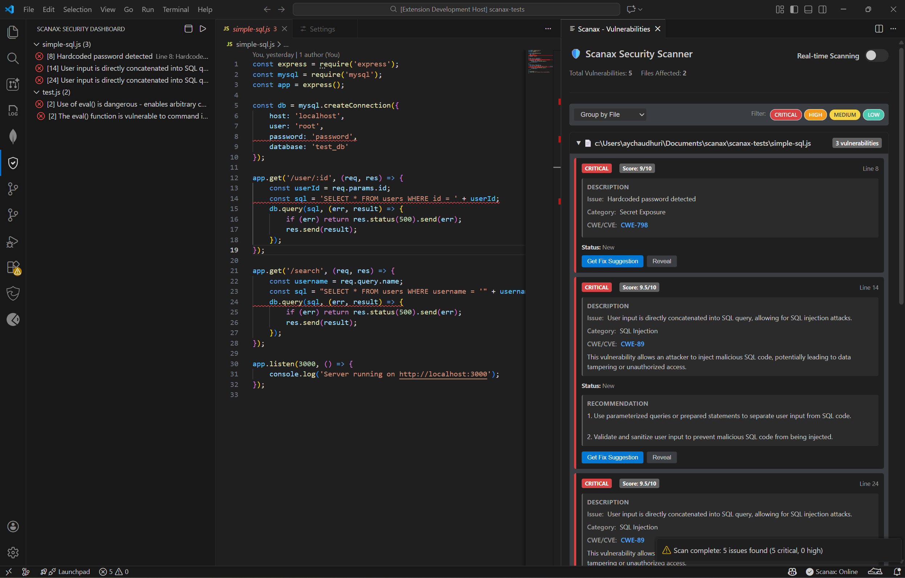
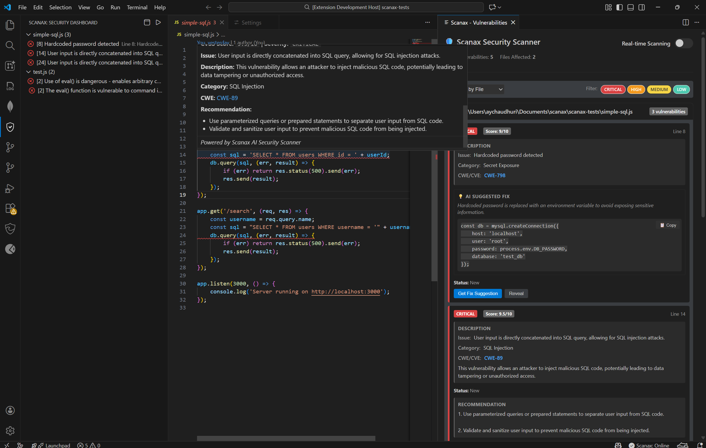
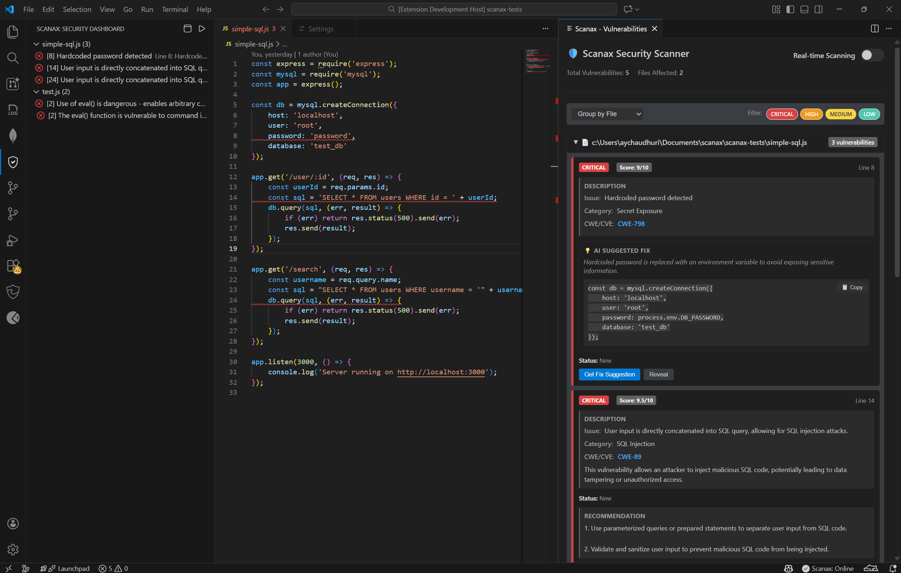

# Scanax Security Scanner

Advanced security vulnerability scanner for Visual Studio Code. Scanax provides AI-powered vulnerability detection with automated fix suggestions for JavaScript, TypeScript, Python, C#, Java, Go, PHP, Ruby, and C/C++.

## Overview

Scanax performs real-time security analysis as you code, detecting SQL injection, XSS, command injection, secrets exposure, and 50+ vulnerability types. All findings are classified using CWE, CVE, and OWASP standards with CVSS scoring.

## Features

### Real-Time Security Scanning
- Detects SQL injection, XSS, command injection, and 50+ vulnerability types
- Inline diagnostics with quick-fix suggestions
- Workspace-wide security analysis
- File-level and project-level scanning

### AI-Powered Fix Suggestions
- Intelligent code fixes powered by Llama 3.1
- One-click vulnerability remediation
- Contextual security recommendations

### Secrets Detection
- Identifies hardcoded API keys, passwords, and tokens
- Detects AWS credentials, private keys, and connection strings
- Flags PII exposure including SSN and credit card numbers

### Dependency Vulnerability Scanner
- Scans package.json, requirements.txt, and other dependency files
- Integrates with OSV database for CVE detection
- Provides version upgrade recommendations

### Standards Compliance
- CWE references for all vulnerabilities
- CVSS severity scoring (0.0-10.0)
- OWASP Top 10:2021 categorization
- Clickable links to vulnerability documentation

## Language Support Matrix

| Language | Injection | XSS | Deserialization | Secrets | Crypto | Path Traversal | Command Injection |
|----------|-----------|-----|-----------------|---------|--------|----------------|-------------------|
| JavaScript/TypeScript | Yes | Yes | Yes | Yes | Yes | Yes | Yes |
| Python | Yes | No | Yes | Yes | Yes | Yes | Yes |
| C# | Yes | Yes | Yes | Yes | Yes | Yes | Yes |
| Java | Yes | Yes | Yes | Yes | Yes | Yes | Yes |
| Go | Yes | No | No | Yes | Yes | No | Yes |
| PHP | Yes | Yes | No | Yes | No | Yes | Yes |
| Ruby | Yes | No | Yes | Yes | No | No | Yes |
| C/C++ | No | No | No | No | No | No | Yes |

## Keyboard Shortcuts

- Ctrl+Shift+S - Scan current file
- Ctrl+Shift+W - Scan entire workspace
- Ctrl+Shift+V - Open vulnerability panel

## Screenshots

### API Key Configuration
Setup view showing how to configure your own Groq API key or use the default free backend.

### Security Dashboard
Main vulnerability panel showing detected issues with severity badges, CWE references, and fix suggestions.

### Inline Detection
Vulnerable code is marked directly in your editor with diagnostic squiggles.

### Hover Tooltips
Hover over vulnerabilities to see complete details without leaving your code.

### AI Fix Suggestions
Get intelligent, context-aware code fixes powered by AI.

---

## Getting Started

### Prerequisites
- VS Code 1.75.0 or higher
- Optional: Groq API key from https://console.groq.com/keys
- Backend server (can use free default or deploy your own)

> **Privacy Notice**: Scanax sends code snippets to external APIs for analysis. See our [Privacy Policy](PRIVACY.md) for details on data handling, third-party services, and your rights under GDPR/CCPA.

### Installation

1. **Install the Extension**
   - Open VS Code
   - Go to Extensions (`Ctrl+Shift+X`)
   - Search for "Scanax Security Scanner"
   - Click Install

2. Configure Extension
   - Open the Scanax sidebar on first launch
   - Choose "Use Default Key" to use free backend, or enter your own Groq API key
   - Configuration is saved automatically after validation

### Quick Start

1. Scan a File: Press Ctrl+Shift+S or run command "Scanax: Run Security Scan"
2. Scan Workspace: Press Ctrl+Shift+W or run command "Scanax: Workspace-wide Security Scan"
3. View Results: Check the Scanax sidebar or Problems panel
4. Get Fix: Click "Get Fix Suggestion" button on any vulnerability

---

## Use Cases

### For Developers
- Catch security issues before code review
- Learn secure coding practices with AI explanations
- Fix vulnerabilities with one-click suggestions

### For Security Teams
- Enforce security standards across projects
- Track vulnerability trends over time
- Export reports for compliance

### For Teams
- Shift-left security into development workflow
- Reduce security debt incrementally
- Educate developers on secure coding

---

## Detected Vulnerability Types

| Category | Examples |
|----------|----------|
| **Injection** | SQL Injection, Command Injection, LDAP Injection |
| **Cross-Site Scripting** | Reflected XSS, Stored XSS, DOM XSS |
| **Authentication** | Broken Authentication, Session Management |
| **Sensitive Data** | Hardcoded Secrets, API Keys, Passwords |
| **XML Issues** | XXE, XML Injection |
| **Deserialization** | Insecure Pickle, YAML Load |
| **Path Traversal** | Directory Traversal, File Inclusion |
| **Cryptography** | Weak Crypto, Broken Algorithms |
| **Dependencies** | Known CVEs, Outdated Packages |

---

## Extension Settings

This extension contributes the following settings:

* `scanax.provider`: Choose AI provider (Default or Groq Custom)
* `scanax.customApiKey`: Your Groq API key for custom scanning

---

## Commands

| Command | Description | Shortcut |
|---------|-------------|----------|
| `Scanax: Run Security Scan` | Scan current file | `Ctrl+Shift+S` |
| `Scanax: Workspace-wide Security Scan` | Scan entire workspace | `Ctrl+Shift+W` |
| `Scanax: Open Vulnerability Panel` | Open vulnerability panel | `Ctrl+Shift+V` |
| `Scanax: Scan Dependencies` | Scan dependency files for CVEs | - |

---

## Technical Details

### Architecture
- **Frontend**: VS Code Extension (TypeScript)
- **Backend**: FastAPI (Python)
- **AI Model**: Llama 3.1 8B (via Groq)
- **Analysis**: Static code analysis + AI-powered detection

### Backend API
- `POST /analyze` - Analyze code for vulnerabilities
- `POST /fix` - Generate fix suggestions
- `POST /scan-dependencies` - Scan dependencies for CVEs

### Privacy & Security
- Code is sent to Groq API for analysis (see [Privacy Policy](PRIVACY.md))
- API keys stored locally in VS Code settings
- No code stored on backend servers
- All processing is stateless
- Full transparency: [Open source on GitHub](https://github.com/IUC4801/scanax)

---

## Known Issues

- Large files (>1MB) are skipped to prevent performance issues
- Some language-specific checks may have false positives (use "Report False Positive" feature)
- Backend may take 30-60 seconds to wake up on first request (free tier)

---

## Troubleshooting

### Backend Connection Issues
- **Error**: "Cannot connect to backend"
- **Solution**: Wait 30-60 seconds for backend to wake up, then retry
- **Alternative**: Configure custom backend URL in settings

### No Vulnerabilities Detected
- Ensure file is saved (scan on save must be enabled)
- Check supported file types: .js, .ts, .py, .cs, .java, .go, .php, .rb, .c, .cpp
- Verify real-time scanning is enabled in settings

### API Key Validation Failed
- Verify Groq API key is valid at https://console.groq.com/keys
- Check internet connectivity
- Try using "Default (Free)" provider instead

### Performance Issues
- Use `.scanaxignore` file to exclude large directories (node_modules, dist, build)
- Disable real-time scanning for very large projects
- Clear scan cache: Run command "Scanax: Clear Scan Cache"

---

## Release Notes

### 0.0.1

Initial release with real-time security scanning, AI-powered fix suggestions, secrets detection, CWE references, CVSS scoring, and multi-language support.

---

## Contributing

Contributions are welcome! Please feel free to submit a Pull Request.

1. Fork the repository
2. Create your feature branch (`git checkout -b feature/AmazingFeature`)
3. Commit your changes (`git commit -m 'Add some AmazingFeature'`)
4. Push to the branch (`git push origin feature/AmazingFeature`)
5. Open a Pull Request

---

## License

This project is licensed under the MIT License - see the [LICENSE](LICENSE) file for details.

## Support & Resources

- **Issues**: [GitHub Issues](https://github.com/IUC4801/scanax/issues)
- **Privacy Policy**: [PRIVACY.md](PRIVACY.md)
- **Documentation**: [GitHub Wiki](https://github.com/IUC4801/scanax/wiki)
- **Changelog**: [CHANGELOG.md](CHANGELOG.md)
- **Source Code**: [GitHub Repository](https://github.com/IUC4801/scanax)
- **Publisher**: [Ayushi Chaudhuri](https://marketplace.visualstudio.com/publishers/AyushiChaudhuri)

---

## About the Publisher

**Publisher**: Ayushi Chaudhuri  
**Marketplace ID**: AyushiChaudhuri  
**GitHub**: [@IUC4801](https://github.com/IUC4801)  

Scanax is built & maintained by an independent developer passionate about making security tooling accessible to all developers. Built with ❤️ for the developer community.

---

**Enjoy safer coding with Scanax!**
